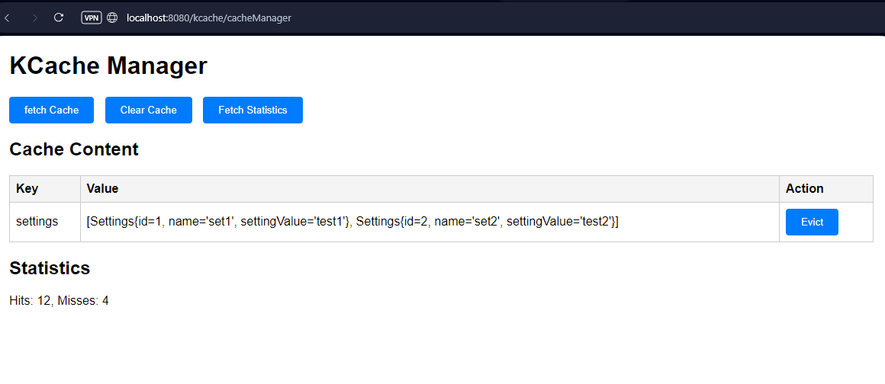

# # K-CACHE Kullanım Kılavuzu

## Projeye K-CACHE Eklenmesi
K-CACHE, Maven projenize bir bağımlılık olarak eklenebilir. Bunun için `pom.xml` dosyanıza aşağıdaki satırları ekleyin:

```xml
<dependency>
    <groupId>com.kocak</groupId>
    <artifactId>K-CACHE</artifactId>
    <version>1.0.0.1</version>
</dependency>
```

Eğer bu bağımlılığı GitHub Package Registry üzerinden alıyorsanız, ilgili repository ayarlarının `settings.xml` dosyanızda tanımlı olduğundan emin olun.

## Kullanım Örneği
### 1. Anotasyon Kullanımı
K-CACHE, Spring uygulamanızda kolayca kullanılabilir. Bir metodu cachelemek için `@KCacheable` anotasyonunu kullanabilirsiniz.

**Örnek Kullanım:**
```java
package com.kocak.sample;

import org.springframework.boot.SpringApplication;
import org.springframework.boot.autoconfigure.SpringBootApplication;
import org.springframework.context.annotation.ComponentScan;
import org.springframework.context.annotation.EnableAspectJAutoProxy;

@SpringBootApplication
@ComponentScan(basePackages = {"com.kocak.sample", "com.kocak.kcache"})
public class KCacheSampleApplication {

    public static void main(String[] args) {
        SpringApplication.run(KCacheSampleApplication.class, args);
    }

}

```

```java
import com.kocak.kcache.annotation.KCacheable;
import org.springframework.stereotype.Service;

@Service
public class ExampleService {

    @KCacheable(key = "#id")
    public String getData(String id) {
        // Burada ağır bir işlem simüle edilebilir.
        return "Data for ID: " + id;
    }
}
```

Bu örnekte, `getData` metodu çağrıldığında sonuç cache'e kaydedilir. Aynı parametrelerle yapılan sonraki çağrılar doğrudan cache'den döndürülür.

### 2. Cache Yönetimi
K-CACHE, cache yönetimi için bir web arayüzü sunar. Uygulama çalıştırıldığında, aşağıdaki URL üzerinden cache durumunu görüntüleyebilir ve cache temizleme işlemleri yapabilirsiniz:

```
http://localhost:8080/kcache
```

Arayüzde şunları yapabilirsiniz:
- Mevcut cache'leri görüntüleme
- Belirli bir cache'i temizleme
- Tüm cache'leri temizleme

### 3. Programatik Cache Yönetimi
K-CACHE, programatik olarak cache işlemlerini yönetmenize olanak tanır.

**Örnek:**

```java
import com.kocak.kcache.manager.KCacheManager;
import org.springframework.beans.factory.annotation.Autowired;
import org.springframework.stereotype.Component;

@Component
public class CacheAdmin {

    @Autowired
    private KCacheManager cacheManager;

    public void clearSpecificCache(String cacheName) {
        cacheManager.evict(key);
    }

    public void clearAllCaches() {
        cacheManager.clear();
    }
}
```

Bu örnekte, `CacheAdmin` sınıfı belirli bir cache'i veya tüm cache'leri temizlemek için kullanılabilir.

```java
@Service
public class ExampleService {

    @KCacheable(key = "#id", expireAfter = 60000, expireAfterAccessCount = 3)
    public String getData(String id) {
        //işlem
        return "Data for ID: " + id;
    }
}
```
Bu örnekte:

Cache, 60 saniye (60000 ms) sonra geçerliliğini kaybeder.
Aynı veri cache'den en fazla 3 kez okunabilir; 4. kez çağrıldığında cache sıfırlanır.


## Konfigürasyon
### application.properties Ayarları
K-CACHE için özelleştirilmiş ayarları `application.properties` dosyasına ekleyebilirsiniz:

```properties
Kcache.port=8080  # port
```

## Sürüm Bilgileri
- **Sürüm:** 1.0.1
- **Java Versiyonu:** 21
- **Spring Framework Versiyonu:** 3.4.2


